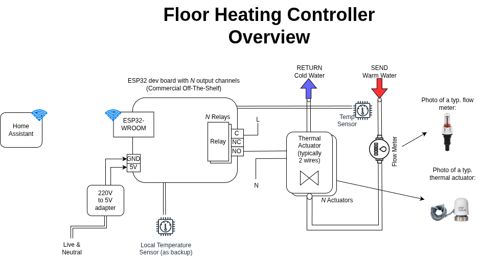
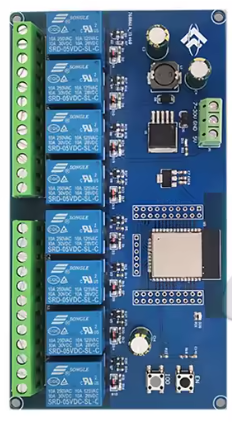
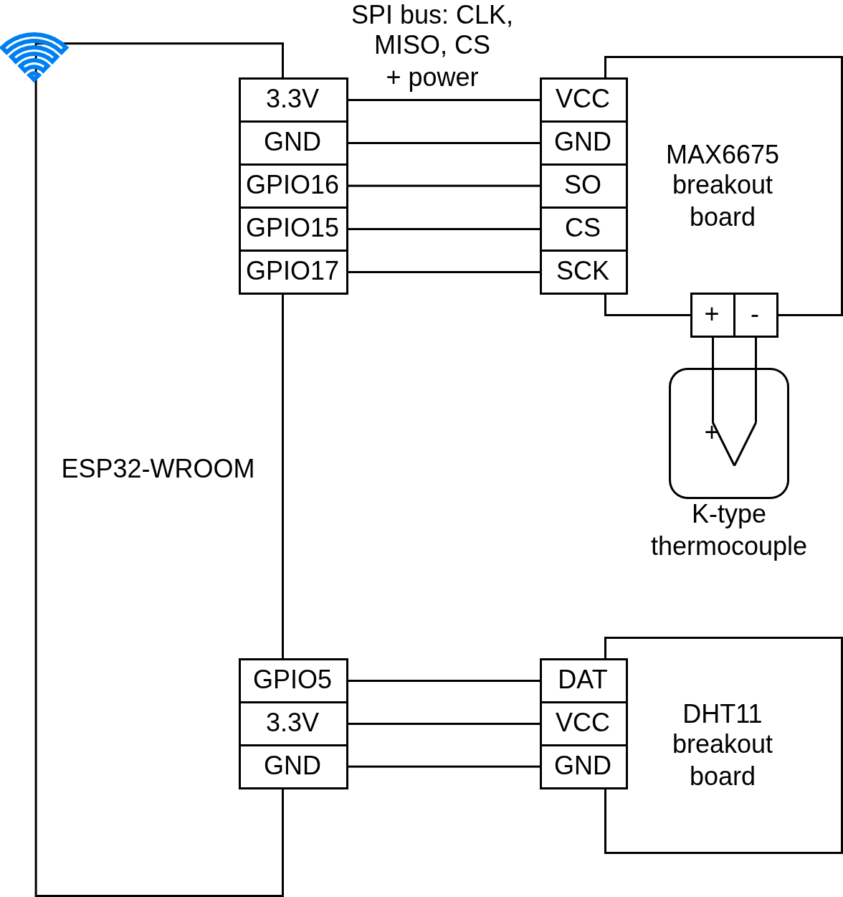
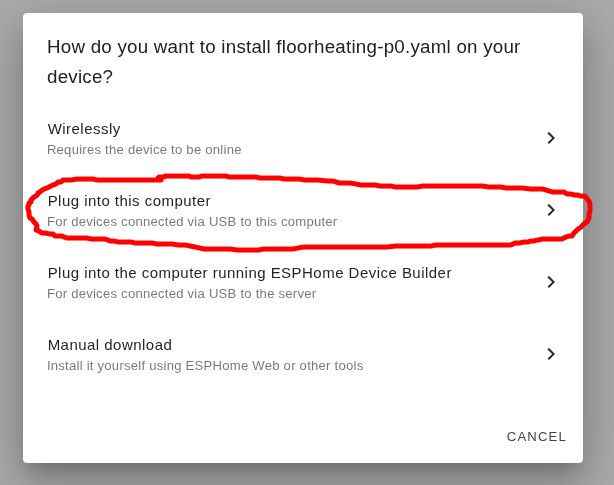

# floor-heating-controller

This is an [ESPHome](https://esphome.io/) project to present to [HomeAssistant](https://www.home-assistant.io/) a floor heating controller, i.e. a board that can turn on or off the flow of warm water in under-floor heating pipes.

In particular this project provides an [ESPHome package](https://esphome.io/components/packages/) that is easy to reference
from an ESPHome configuration. Keep reading for more details.


## Highlights

* Plain simple actuator board, all the hardware is Commercial Off-The-Shelf (COTS), 
typically available on Aliexpress, and very cheap; easy to replace in future if it fails;
* Connects to your [Home Assistant](https://www.home-assistant.io/) instance via Wi-fi;
* Designed to be capable of running in a dumb, non-smart mode if Wi-fi connection drops
or your HomeAssistant instance has troubles;
* Presents _N_ basic switches plus 2 temperature sensors to Home Assistant; each switch represents an heating under-floor circuit; temperatures are sampled for both the incoming warm water and for room temperature


## Architecture Overview



This project allows to easily setup in HomeAssistant a [Generic Thermostat](https://www.home-assistant.io/integrations/generic_thermostat/) entity that allows to control the floor heating system:


```yaml
climate:
  - platform: generic_thermostat
    name: Floor Heating
    heater: switch.floorheatingactuatorcontroller_relay1
    target_sensor: sensor.floorheatingactuatorcontroller_ambient_temperature
    min_temp: 15
    max_temp: 25
    ac_mode: false
    target_temp: 17
    cold_tolerance: 0.3
    hot_tolerance: 0
    min_cycle_duration:
      minutes: 1
    initial_hvac_mode: "off"
    precision: 0.1
    # preset mode temps
    away_temp: 20
    home_temp: 22
    sleep_temp: 21
```

One climate entity is connected to 1 temperature sensor and to 1 switch for the "heater" exposed by this ESPHome project.
So if you have e.g. 5 rooms on your floor and you want to control heating independently you should:

* install a temperature sensor in each room
* cable the thermal actuator of each room to each relay available on this ESPHome project (see below ESP32 board details)
* define a Generic Thermostat for each room

Please note that instead of writing YAML code in your HomeAssistant `configuration.yaml` file you probably
want to use the HomeAssistant UI: look for Helpers and choose `Generic Thermostat` from the list.


## Bill Of Material

* ESP32 relay board [bought on Aliexpress](https://it.aliexpress.com/item/1005007027676026.html?spm=a2g0o.order_list.order_list_main.31.42f53696cth4st&gatewayAdapt=glo2ita) (17.5€ in Oct 2025).
Its main characteristics are:

  * Sports an [ESP32-WROOM-32E module](./datasheets/esp32-wroom-32e_esp32-wroom-32ue_datasheet_en.pdf) with 240MHz clock, 320kB RAM, 4MB Flash
  * 5V DC power supply terminal
  * 8 relay channels, both NC and NO contacts available




* 220V to 5V power adapter (5W), [bought on Aliexpress](https://it.aliexpress.com/item/1005006981553550.html?spm=a2g0o.order_list.order_list_main.47.45de36964bR8Kp&gatewayAdapt=glo2ita) (4€ in Oct 2025)

* Temperature sensors, bought on Aliexpress (few € in Oct 2025)

  * `MAX6675` and a K-type thermocouple for reading pipe temperature,
    see https://esphome.io/components/sensor/max6675/
  * `DHT11`: Digital Temperature Humidity Sensor,
    see https://esphome.io/components/sensor/dht/

Alternative sensors I also tested in an instance of this ESPHome Package are:

  * `MAX31855` and a K-type thermocouple for reading pipe temperature,
    see https://esphome.io/components/sensor/max31855/
  * `DHT22`: Digital Temperature Humidity Sensor,
    see https://esphome.io/components/sensor/dht/


## ESP32 Relay Board Pinout

The ESP32 relay board currently being used has the following pinout:

* GPIO23: led D20
* GPIO13: relay 1
* GPIO12: relay 2
* GPIO14: relay 3
* GPIO27: relay 4
* GPIO26: relay 5
* GPIO25: relay 6
* GPIO33: relay 7
* GPIO32: relay 8

Please note that GPIO12 is a strapping PIN and should only be used for I/O with care.
Attaching external pullup/down resistors to strapping pins can cause unexpected failures.
See https://esphome.io/guides/faq.html#why-am-i-getting-a-warning-about-strapping-pins

In addition to these, the following GPIOs are used for the temperature sensors:

* GPIO5: `DHT11` sensor
* GPIO16 (MISO), GPIO17 (CLK) and GPIO15 (CS): for the SPI bus to read the `MAX6675` sensor

Graph of the ESP-to-sensor connections:




## Full ESPHome configuration

See the [main.yaml](./main.yaml) file for the ESPHome package provided by this project.
Please note that this is an [ESPHome package](https://esphome.io/components/packages/) and thus it uses [substitutions](https://esphome.io/components/substitutions/) to make the YAML config file as reusable as possible.

An actual ESPHome YAML config using this package could be:

```yaml
packages:
  remote_package_files:
    url: https://github.com/f18m/floor-heating-controller/
    files: 
      - path: main.yaml
        vars:
          encryption_key: !secret encryption_key
          wifi_ssid: !secret wifi_ssid
          wifi_password: !secret wifi_password
          wifi_ap_password: !secret wifi_ap_password
          ota_password: !secret ota_password
    ref: main  # optional
    refresh: 1d  # optional

esphome:
  name: "floorheating-p0"
  friendly_name: FloorHeatingActuatorController-P0
```

which is basically assigning the secrets defined in the ESPHome global "secrets.yaml" to the variables of this package.
Then it's overriding just the name & friendly name from the package.
See e.g. [example-instance.yaml](./example-instance.yaml)
and [example-instance-with-different-sensors.yaml](./example-instance-with-different-sensors.yaml).


## First ESPHome install

When you receive your ESP32 relay board, you will need to carry out the first ESPHome installation
by "wire". Afterwards, you'll be able to install any ESPHome profile over the wireless connection using
the so-called On-The-Air update (OTA update).

Make sure you read carefully the [ESPHome guide](https://esphome.io/guides/physical_device_connection/)
on how to Physically Connecting to your Device.

You will need a USB-to-serial module.
I bought [one on Aliexpress](https://it.aliexpress.com/item/1005004742270942.html?spm=a2g0o.order_list.order_list_main.107.33a03696c66vOs&gatewayAdapt=glo2ita) for 2€.
A couple of pictures zooming on the programmer itself and then its connections to the ESP32 relay board:


Once physical connection is ready, you will be able to install ESPHome initial firmware:

1. Log on your HomeAssistant and go to the ESPHome web interface
2. Create a new device, copy-pasting the [example-instance.yaml](./example-instance.yaml)
3. Launch "Validate" from the 3-dots menu for your new ESPHome device
4. Launch "Install" from the 3-dots menu for your new ESPHome device and choose "Plug into this computer" option:




After successful flashing you should be able to see logs coming from your board and, if the Wifi credentials
are OK, your board should appear in the list of DHCP clients of your DHCP server.


## Labelling of the board

Since most likely your floor heating controller will be installed in some hidden box
and will stay around for a lot of time (many years hopefully), I suggest to provide 
some documentation reference for that.
A simple approach is to print a QR code pointing at this page.

Here you can find a QR code I produced with the optimal [miniQR code generator](https://mini-qr-code-generator.vercel.app/):


## TODO

* Write the [external component](https://esphome.io/components/external_components/) that will make it possible to control relays using the local temp sensor when connection to HA fails.

* Signal wifi connectivity through the LED


## Similar projects

* [Smart Underfloor Heating Controller](https://hackaday.io/project/190828-smart-underfloor-heating-controller)
* [Nicolas Liaudat's Floor Heating Controller](https://github.com/nliaudat/floor-heating-controller)
